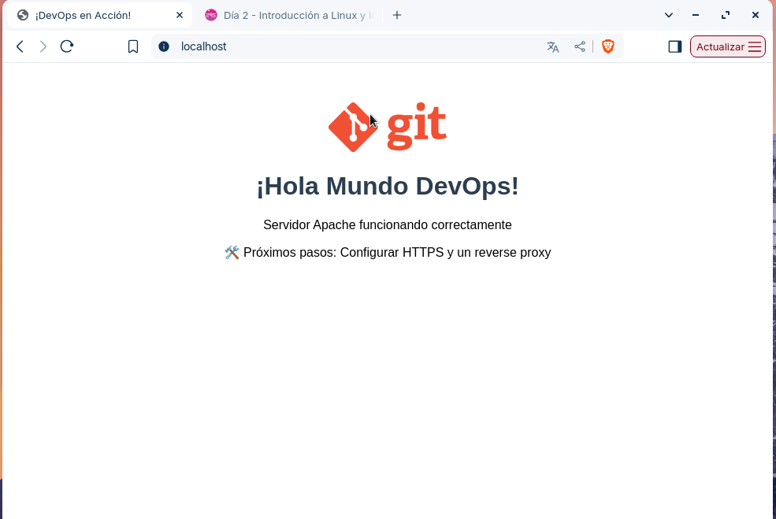
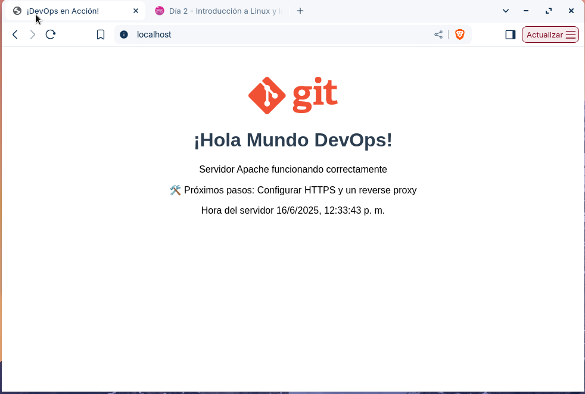
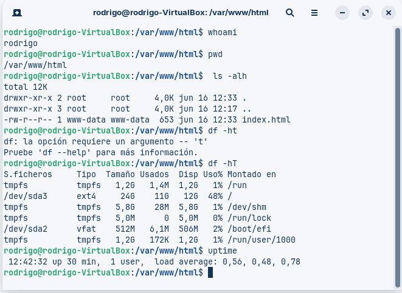
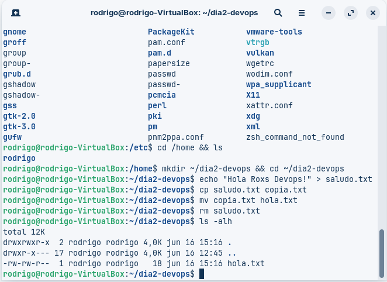
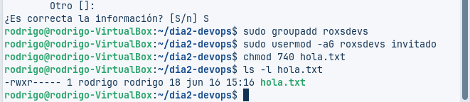

# 90DaysOfDevops
🚀 Semana 01 - ejercicios dia 2








```bash
chmod u=rwx,g=rx,o= hola.txt
```
El anterior comando entrega permisos a nivel de usuario, grupo y otros para el archivo hola.txt, donde al usuario u owner le da permisos
de lectura, escritura y ejecución, para el grupo entrega permisos de lectura y ejecución y a los otro no le otorga ningún permiso